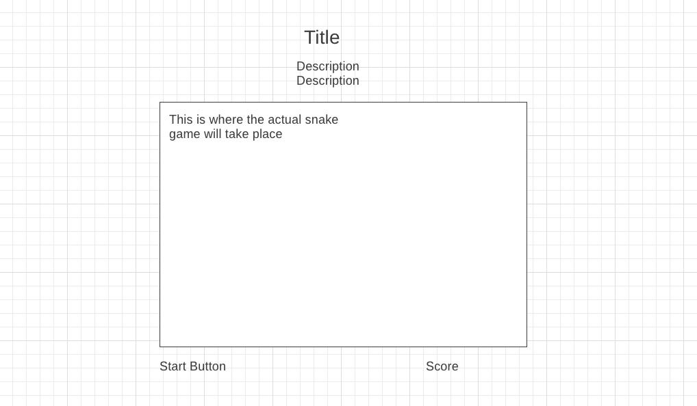

# Snake Game
First game ever made 

###Overview
The game is a recreation of the classic snake game. In short, you navigate the snake and help it gorw by consuming whats on the game grid. I picked this game becuase its a classic game, worthy to pay tribute as well as it proving to use multiple js elements that I've learned from the course. 

###Explanation 
The rules of the game are simple. Move the snake towards the object of the screen and help it it grow. Your score increases the more objects you consume. You lose when the snake collides with any part of its body. 

###Wireframe

###User stories: 
-When I press any of the arrow keys, the snake's head will move in that direction and the body will follow in a snake like fashion, where the later segments will take place of the segments preceding it. 
-When the snake head meets with any object on the screen besides its body, it adds that object to its own body. 
-When the snake head meets with any part of its body, the game is over.

###MVP Checklist
-Does the snake head move around the grid depending on which arrow key is pressed? 
-Does the snake append any object consumed to its own body?
-Does the snake's body move in a snake-like fashion? 
-Does the game end when the snake head collides with it's body?

###Strecth Goals:
Make a simple, yet aesthetically pleasing design/color scheme. 
Add visuals to when objects appears on screen 
Try to add sound effects when the snake consumes an object. 